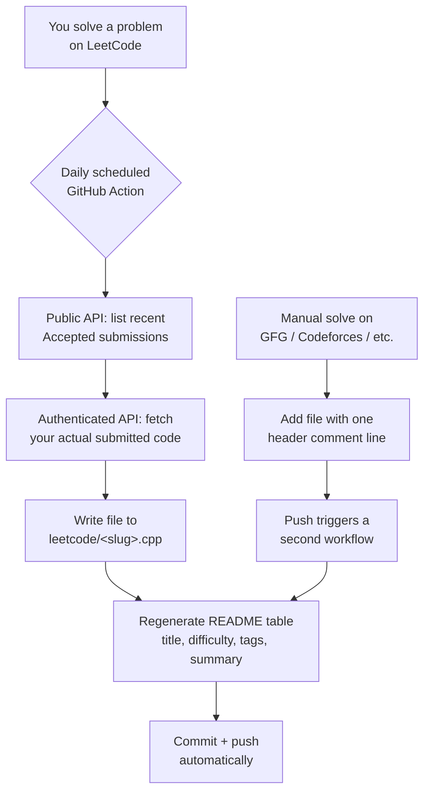

# 🧠 Automated DSA Solution Tracker

A self-updating GitHub repository: solve a problem on LeetCode, and a scheduled bot pulls your accepted solution, writes it into the repo, and regenerates a live README table — automatically, with no manual git work for LeetCode solves.

<!--
  Replace <username>/<repo> below with your actual GitHub path once forked,
  so these badges reflect YOUR workflow runs, not the original repo's.
-->


---

## Table of Contents

- [What This Is](#what-this-is)
- [How It Works](#how-it-works)
- [Features](#features)
- [Setting This Up Yourself](#setting-this-up-yourself)
- [Adding Non-LeetCode Solutions](#adding-non-leetcode-solutions)
- [How Sorting Works](#how-sorting-works)
- [Limitations](#limitations)
- [Further Reading](#further-reading)

---

## What This Is

Most "daily DSA tracker" repos rely on the owner remembering to manually copy code, write a description, and update a table every single day. This project removes that step entirely for LeetCode: a scheduled job checks your account, detects newly accepted submissions, and takes care of the rest.

## How It Works



Two independent GitHub Actions workflows drive this:

| Workflow | Trigger | Responsibility |
|---|---|---|
| `leetcode-sync.yml` | Daily cron + manual dispatch | Detects and pulls new LeetCode solves |
| `update-readme.yml` | On push of any `.cpp` file | Regenerates the table when you manually add a solution |

## Features

- **Zero-touch LeetCode tracking** — solve on the site, the repo updates itself
- **Auto-fetched problem metadata** — title, difficulty, tags, and link pulled directly from LeetCode
- **AI-generated summaries** (optional) — via Anthropic or the free Groq tier
- **Content-hash deduplication** — identical solutions never produce duplicate rows
- **Real solve-date ordering** — sorted by when you actually solved it, not when git happened to commit it
- **Self-healing encoding handling** — tolerates files accidentally saved in non-UTF-8 encodings
- **Stale-fetch auto-retry** — a failed metadata fetch retries on the next run instead of getting stuck

## Setting This Up Yourself

### 1. Fork or clone this repo
Keep the folder structure intact:
```
.github/workflows/leetcode-sync.yml
.github/workflows/update-readme.yml
scripts/update_readme.py
scripts/leetcode_sync.py
README.md   (must keep the <!-- SOLUTIONS:START/END --> markers)
```

### 2. Get your LeetCode session cookies
1. Log into [leetcode.com](https://leetcode.com) in your browser.
2. Open DevTools (`F12`) → **Application** tab → **Storage → Cookies** → `https://leetcode.com`.
3. Use the filter box to find and copy the values of:
   - `LEETCODE_SESSION`
   - `csrftoken`

> ⚠️ These act like a login session for your account. Only ever store them as GitHub Actions secrets — never commit them to a file, and don't share them.

### 3. Add repository secrets
**Settings → Secrets and variables → Actions → New repository secret:**

| Secret | Value | Required? |
|---|---|---|
| `LEETCODE_USERNAME` | Your LeetCode handle | ✅ |
| `LEETCODE_SESSION` | Cookie value from step 2 | ✅ |
| `LEETCODE_CSRF_TOKEN` | Cookie value from step 2 | ✅ |
| `ANTHROPIC_API_KEY` | For AI-written summaries | Optional |
| `GROQ_API_KEY` | Free alternative to the above | Optional |

### 4. Enable write permissions for Actions
**Settings → Actions → General → Workflow permissions → "Read and write permissions."**
Without this, the bot's final `git push` fails silently while every other step still shows green.

### 5. Test it
**Actions tab → "Sync LeetCode solutions" → Run workflow** — triggers it immediately instead of waiting for the next scheduled run.

### 6. (Optional) Adjust the schedule
The cron in `leetcode-sync.yml` runs at `30 2 * * *` UTC (~8:00 AM IST). GitHub Actions cron always runs in UTC — convert to your timezone and edit the `cron:` line if you want a different local time.

## Adding Non-LeetCode Solutions

For platforms without a public API (GFG, Codeforces, InterviewBit, etc.), add the file under a folder named after the platform, with one header line:

```cpp
// Problem: Running GCD Pairing | Platform: GFG | Difficulty: Medium | Link: https://www.geeksforgeeks.org/...
#include <bits/stdc++.h>
using namespace std;
```

Only `Title` and `Link` are required. Push it, and `update-readme.yml` picks it up automatically.

## How Sorting Works

The README table sorts by **actual solve date**, sourced from LeetCode's own submission timestamp (stored in `scripts/.leetcode_sync_state.json`). Manually-added files without that data fall back to git commit date.

## Limitations

Worth knowing before you rely on this:

- **LeetCode's endpoints used here are unofficial** (the same ones the site's own frontend uses) — not a documented public API, and it can change without notice.
- **Session cookies expire** every few weeks. When they do, the sync step logs `session may be expired or invalid` and skips fetching new code until you refresh the secrets — it won't lose data, just pause.
- **Only your last ~20–60 accepted submissions are checked per run** (configurable), so a long gap without running the workflow could miss older solves falling out of that window.

## Further Reading

See [`DOCS.md`](./DOCS.md) for a detailed setup/troubleshooting log, including real bugs hit while building this and how they were diagnosed and fixed.
